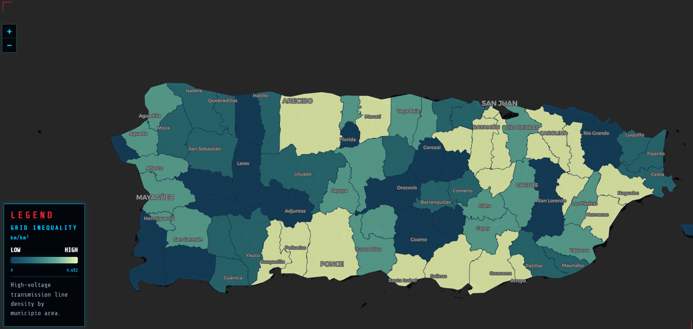
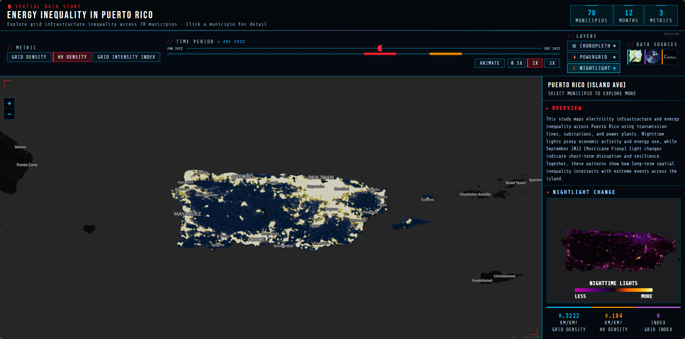
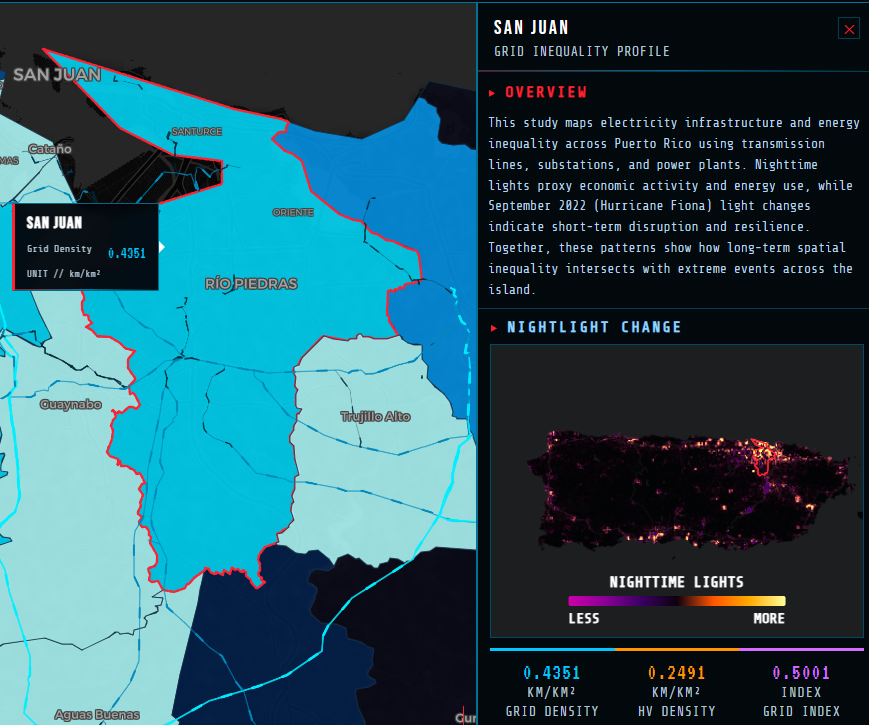
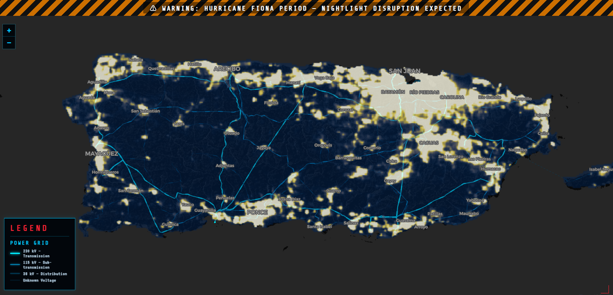

# Energy Inequality In Puerto Rico

**A spatial data story visualising electricity infrastructure inequality across Puerto Rico's 78 municipios.**

##Created & Visulised by Arthur Zhang##

🌐 **Live Site:** [https://ArthurZhang69.github.io/CASA0028-DATASTORY-INDIVIDUAL-PUERTO-RICO/](https://ArthurZhang69.github.io/CASA0028-DATASTORY-INDIVIDUAL-PUERTO-RICO/)

---

## Overview

This interactive dashboard maps electricity grid infrastructure and energy inequality across Puerto Rico using transmission lines, substations, and power plant data. Nighttime light intensity serves as a proxy for economic activity and energy use, while September 2022 (Hurricane Fiona) light changes capture short-term disruption and community resilience. Together, these patterns reveal how long-term spatial inequality intersects with extreme weather events across the island.

---

## Features

- **Choropleth map** — Three switchable metrics (Grid Density, HV Density, Grid Intensity Index) visualised across all 78 municipios
- **Power grid overlay** — Transmission lines at 230 kV, 115 kV, and 38 kV visualised by voltage class
- **Nighttime lights layer** — Monthly VIIRS nighttime light composites (Jan–Dec 2022) with animated playback
- **Hurricane Fiona warning** — Contextual alert and tick highlight for September 2022
- **Municipio detail panel** — Click any municipio to explore its grid profile and nightlight change preview
- **Time slider** — Scrub through 12 months with 0.5×, 1×, 2× animation speeds
- **Responsive legend** — Dynamically shows/hides based on active layers

---

## User Guide

### Getting Started

When you first open the site, the map loads at **September 2022** — the month Hurricane Fiona made landfall in Puerto Rico. An amber hazard stripe across the top of the map signals this is an anomalous period, with significant nighttime light disruption expected across the island. This is intentional: the storm's impact is the narrative anchor of the whole story.


---

### Exploring the Map

**Switch between metrics** using the three buttons in the top-left (`GRID DENSITY`, `HV DENSITY`, `GRID INTENSITY INDEX`). Each re-colours the choropleth to reveal a different dimension of infrastructure inequality across the 78 municipios.



**Toggle layers** on and off using the `CHOROPLETH`, `POWERGRID`, and `NIGHTLIGHT` buttons in the Layers panel. Try enabling the nightlight layer to overlay monthly satellite light data on top of the grid — when nightlight is on, the choropleth is automatically hidden to keep the map readable.



**Click any municipio** on the map to open its detail profile in the right-hand panel. You'll see:
- The municipio's grid density, HV density, and grid intensity index values at the bottom
- A nighttime light preview map in the panel showing light intensity for that specific area
- The boundary of the selected municipio highlighted in the preview



---

### Exploring the Time Dimension

**Activate the time slider** by turning on the Nightlight layer — this reveals a full 12-month slider (January–December 2022). Drag the slider to scrub through the year and watch the nighttime light pattern change month by month across Puerto Rico.

**Play the animation** by clicking the `ANIMATE` button. Adjust the playback speed using `0.5×`, `1×`, or `2×`. Watch how lights dim dramatically in September 2022 (Hurricane Fiona) and gradually recover through the following months — a visible record of the island's resilience and the uneven pace of recovery across different municipios.



**The September tick mark** on the slider is highlighted in orange as a visual cue — this is the Fiona period. You can click directly on any tick to jump to that month.

---

### Reading the Data Sources

In the top-right corner you'll find three **Data Source cards** — OpenStreetMap, Earth Observatory Group, and Copernicus DEM. **Click any logo or the LEARN MORE link** to open the original data source in a new tab, where you can explore the underlying datasets in full.

---


| Layer | Source |
|---|---|
| Power grid infrastructure | [OpenStreetMap](https://www.openstreetmap.org) |
| Nighttime light composites | [Earth Observatory Group (EOG), Colorado School of Mines](https://eogdata.mines.edu/products/vnl/) |
| Elevation / topography | [Copernicus DEM](https://dataspace.copernicus.eu/explore-data/data-collections/copernicus-contributing-missions/collections-description/COP-DEM) |
| Basemap tiles | [CartoDB Dark Matter](https://carto.com/basemaps/) |
| Nightlight tiles | [Mapbox](https://www.mapbox.com/) |

---

## Tech Stack

- **Frontend:** React + Vite
- **Mapping:** Leaflet.js + Mapbox raster tiles
- **Styling:** Custom CSS with CRT / terminal aesthetic
- **Deployment:** GitHub Pages via `gh-pages`

---

## Local Development

### Prerequisites

- Node.js 18+
- A [Mapbox access token](https://account.mapbox.com/access-tokens/)

### Setup

```bash
# Clone the repository
git clone https://github.com/ArthurZhang69/CASA0028-DATASTORY-INDIVIDUAL-PUERTO-RICO.git
cd CASA0028-DATASTORY-INDIVIDUAL-PUERTO-RICO

# Install dependencies
npm install

# Create environment file
echo "VITE_MAPBOX_TOKEN=your_token_here" > .env

# Start development server
npm run dev
```

### Build & Deploy

```bash
# Build for production
npm run build

# Deploy to GitHub Pages
git add dist -f
git commit -m "deploy"
git subtree push --prefix dist origin gh-pages
```

---

## Metrics

| Metric | Description | Unit |
|---|---|---|
| Grid Density | Total power-grid line length density by municipio area | km/km² |
| HV Density | High-voltage (≥115 kV) transmission line density | km/km² |
| Grid Intensity Index | Composite index combining grid density and infrastructure intensity | index |

---

## Project Context

This project was produced as part of **CASA0028 — Designing Spatial Data Stories** at University College London (UCL). It explores how infrastructure inequality in Puerto Rico's electricity system intersects with its vulnerability to extreme weather, using the September 2022 Hurricane Fiona event as a case study.

---

## Acknowledgements

- UCL Centre for Advanced Spatial Analysis (CASA)
- Earth Observatory Group, Colorado School of Mines, for VIIRS nighttime light data
- OpenStreetMap contributors
- CartoDB for basemap tiles
